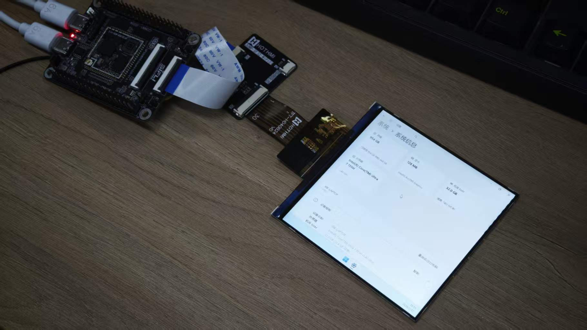
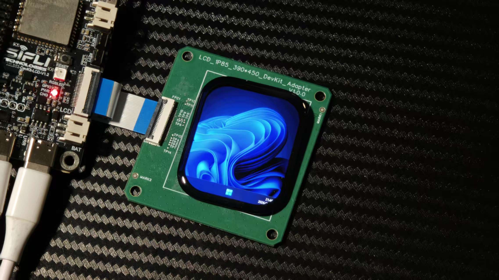
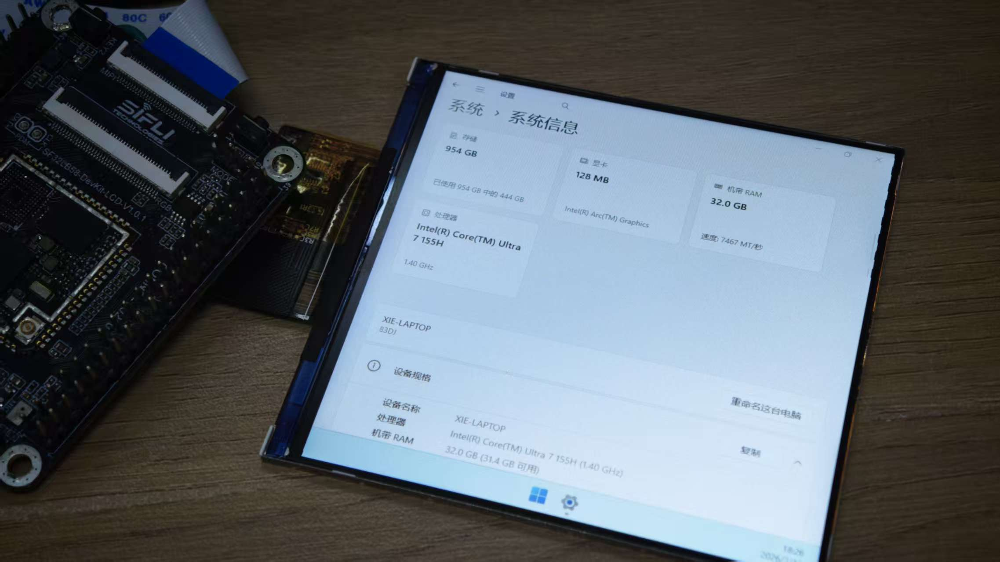
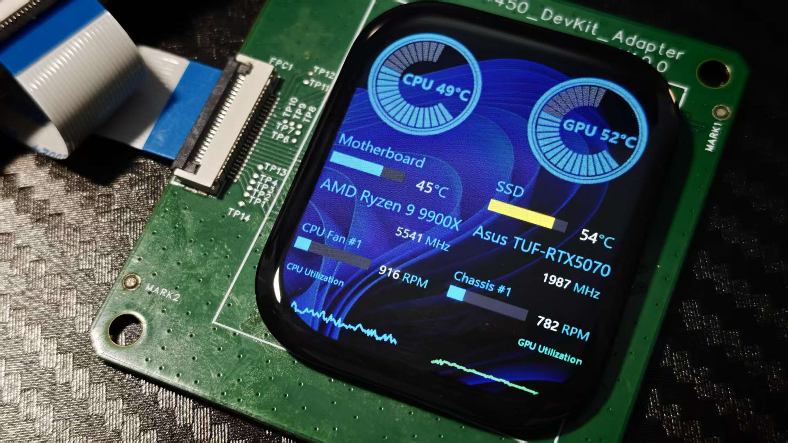

# 基于 CherryUSB Display 的 USB 屏幕
## 概述
适用于Windows（10/11）、Linux平台的USB迷你显示器固件。当设备通过USB连接到主机时，提供屏幕显示功能。
## 支持的开发板
本固件已在以下开发板上测试：
- sf32lb58-lcd_a128r32n1_a1_dsi
- sf32lb52-lcd_n16r8
## 本例程的上位机驱动
https://github.com/chuanjinpang/win10_idd_xfz1986_usb_graphic_driver_display
## 注意事项
- 该固件仅适用于特定的开发板和屏幕型号，若您想在您的硬件上验证，请在源码中修改分辨率，并在menuconfig中修改屏幕参数以适配您的设备。
## 演示图片

## 许可证
 Apache License 2.0
